# Cobaia
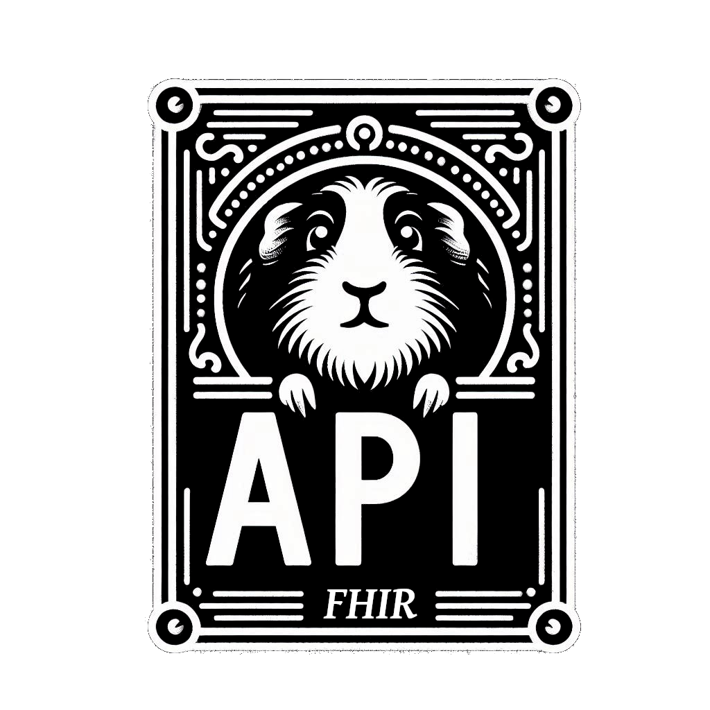

Cobaia API is an experiment built as Python-based API for processing unstructured data into FHIR format with automatic report generation and json schema validation. At this moment it's still in a development stage but it works only with plain text in a local system. 
The project could be explored for investigation and used as it is, or improved easily with some prompt enginering. 

## Architecture

## Dependencies

The system processes unstructured data through LLMs using LM servers like Ollama, LM Studio, or AnythingLM, to generate validated FHIR resources.

You can find some examples of server connection [here](app/rtemplates/)

Below you can see how you can organize it

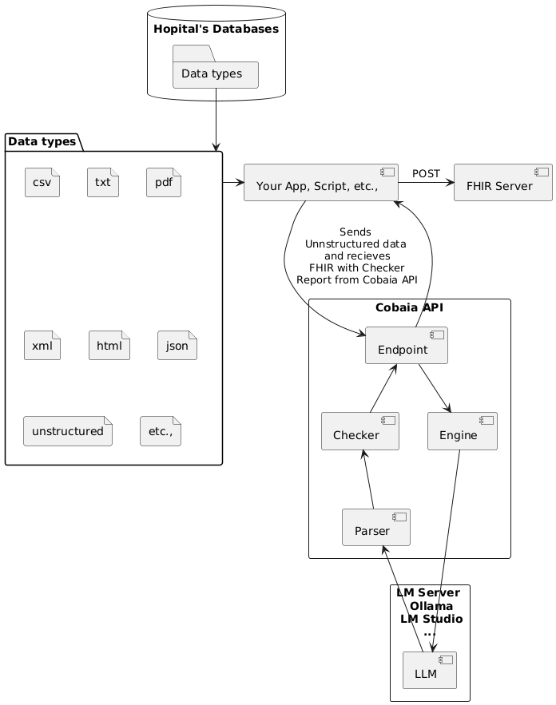

## Features

- **FHIR Conversion**: Transforms data into FHIR-compliant resources
- **Validation**: Includes a checker for FHIR validation using json schemas provided into the configuration
- **User Management**: Role-based and token endpoint access control

## Installation

### Linux/macOS

1. clone the repo and then

```bash
cd cobaia-api
python3 -m venv cobaiaenv
source cobaiaenv/bin/activate
pip install -r requirements.txt
```


### Windows

1. clone the repo and then

```shell
cd cobaia-api
python -m venv cobaiaenv
.\cobaiaenv\Scripts\activate
pip install -r requirements.txt
```

## Usage

### Start the server

```bash
python ./start_server.py
```
### Basic API Flow

1. Using the asigned token send unstructured data to an endpoint
2. The API processes through LLM
3. Returns structured FHIR with validation report
4. Send your new FHIR data to any FHIR server
5. Save your report for automatic or handheld validation

### Endpoints
```
POST /api/<userrole>/<endpointname> - Process data
GET /admin - Admin dashboard (requires admin role)
GET /dashboard - User dashboard
```

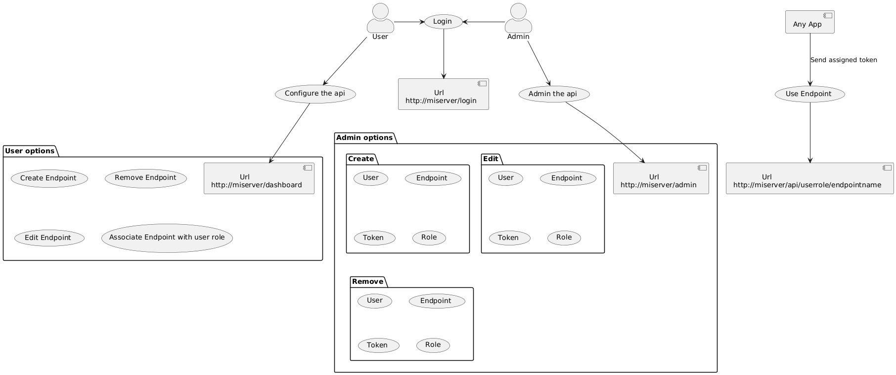

## Default Admin Credentials

Email: admin@example.com
Password: admin


### Admin Panel

The database comes pre-loaded with a user and a couple of endpoints that you can use to see the relationships. Create a user and associate it with a role and an endpoint. You can create an access token so that external applications/scripts can make calls to the API.

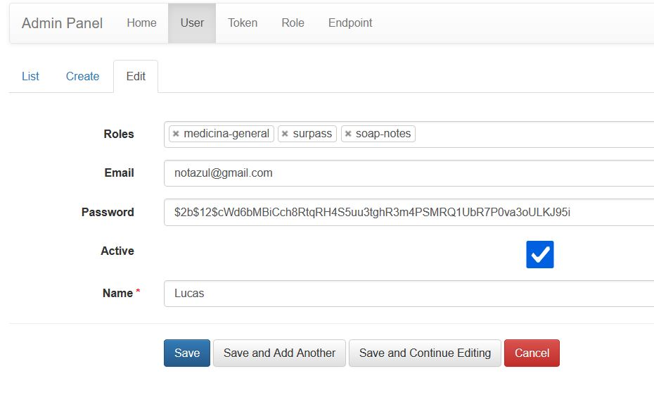

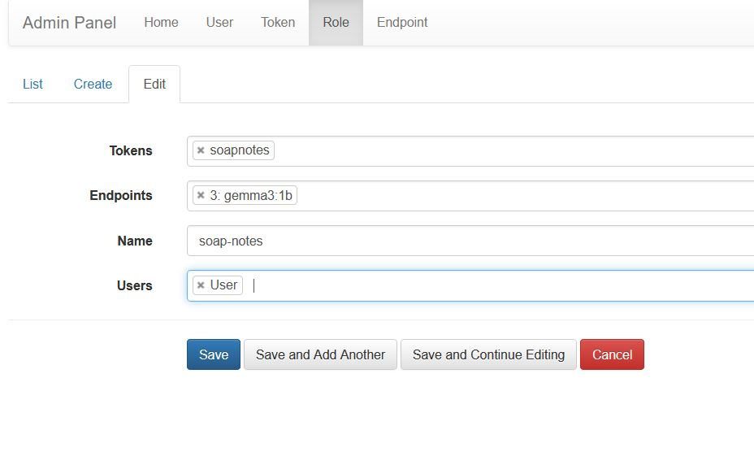

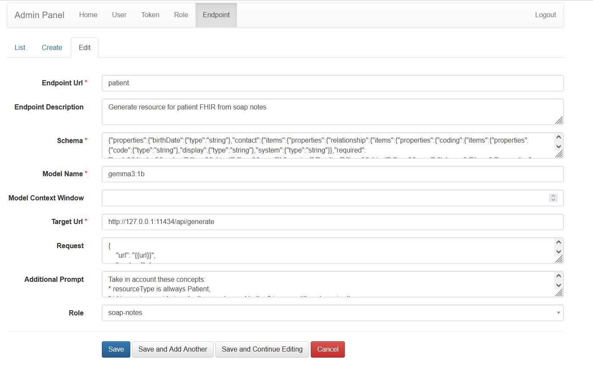

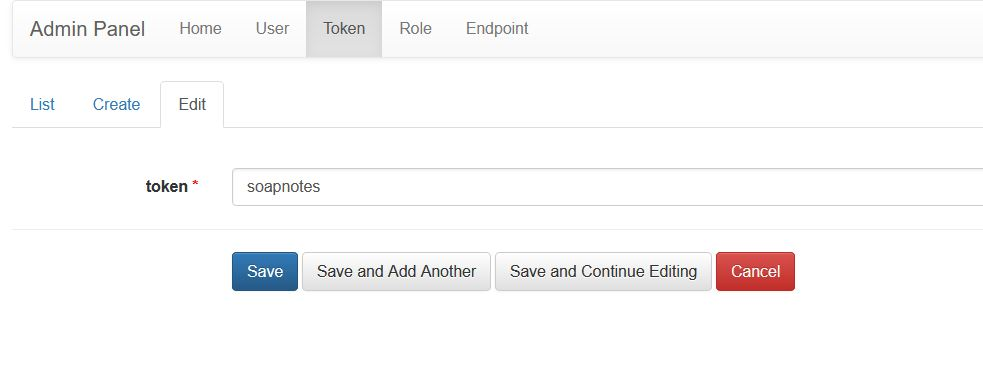

### User Panel

If you create users, they can access their own panel. In it, they can create new endpoints within their role, as well as access a testing environment for each endpoint they own.

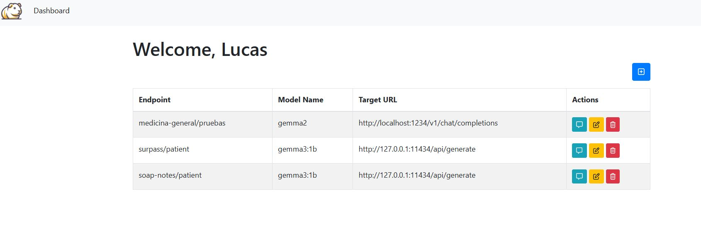

The testing environment allows you to edit some endpoint variables.

The model to run in (ollama / LM Studio) and the validation.

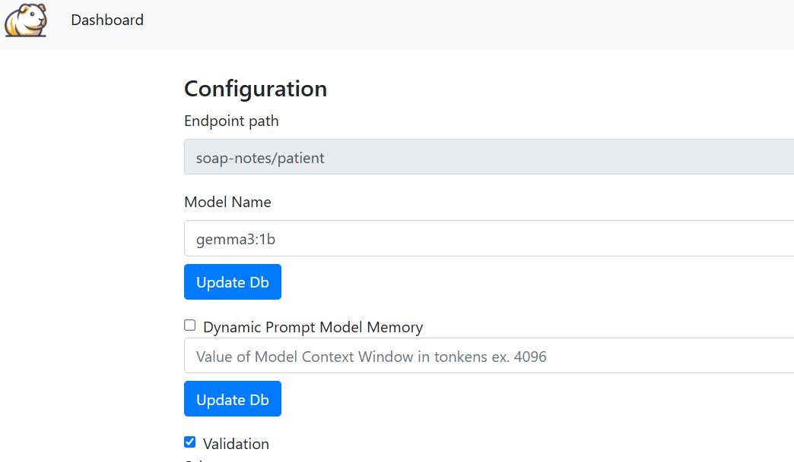

The schema against which to validate the FHIR resource.

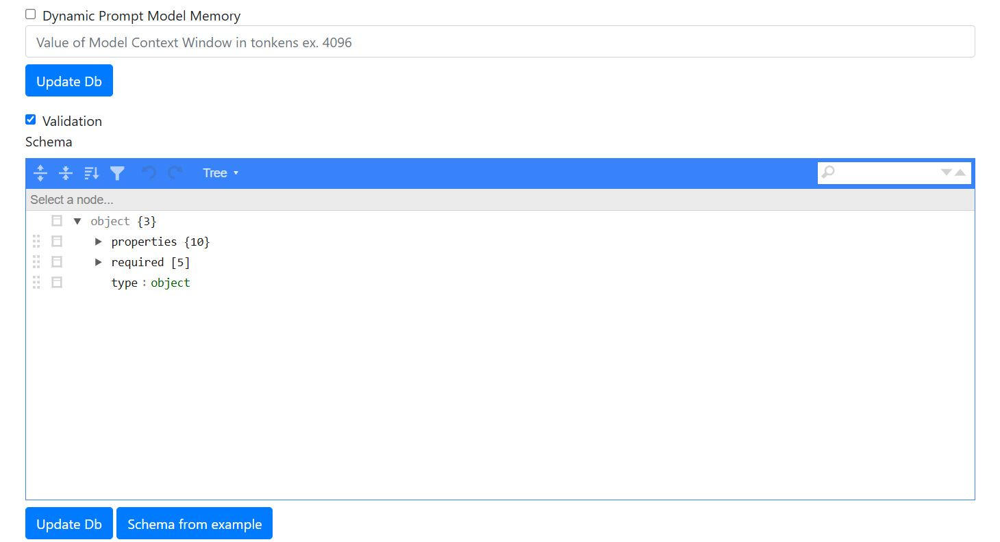

Change or add extra data and/or examples to the base prompt.

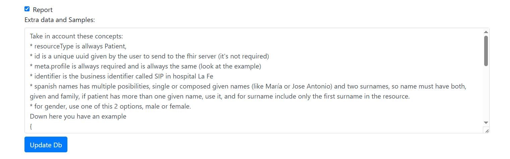

As well as test in a chat-style environment.

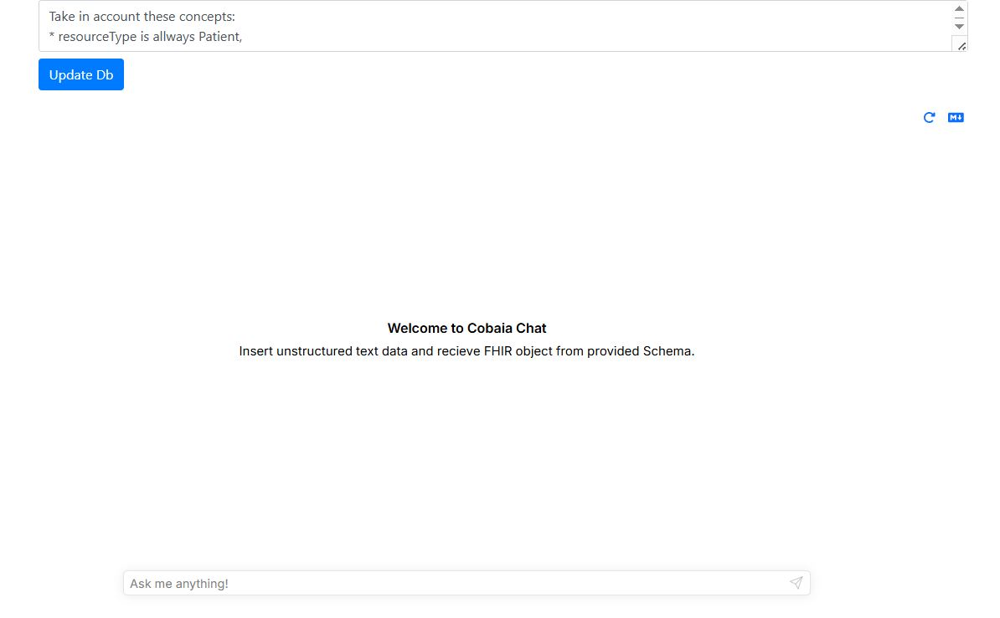


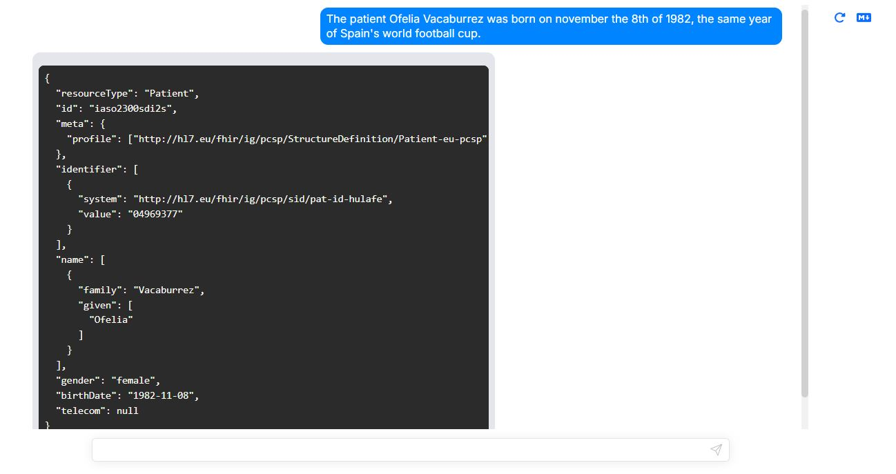

Finally, you can also review the report generated by the platform by clicking on the markdown icon.

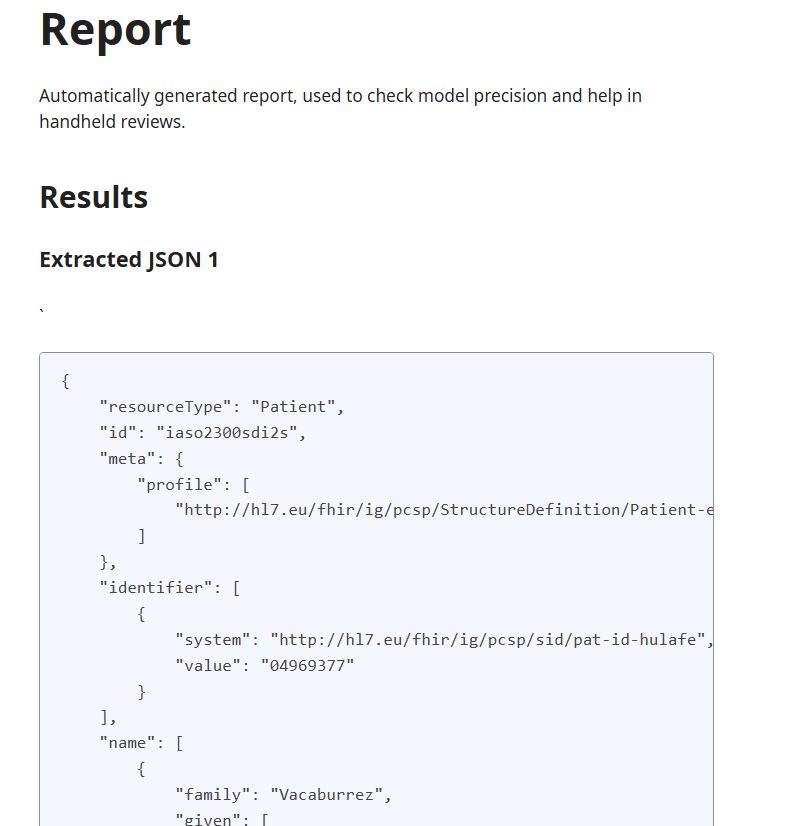

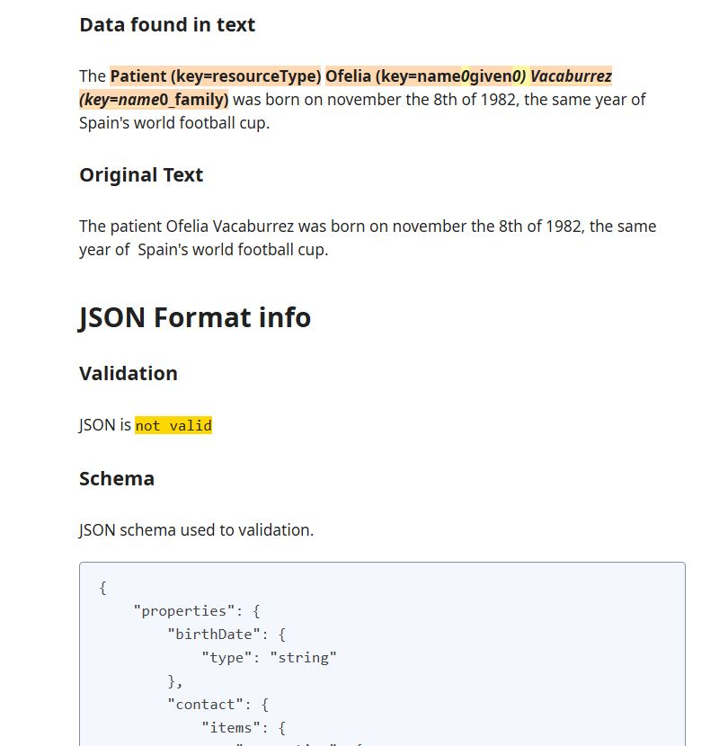

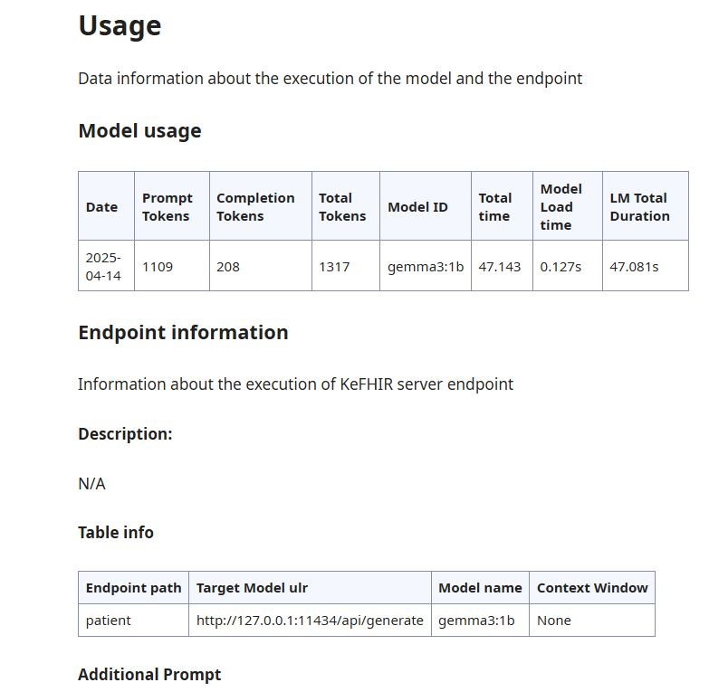


## Progress

* fixing recursive bug on reporter
* fixing bug on json validation

---

# Cobaia


Cobaia API es un experimento desarrollado como una API basada en Python para procesar datos no estructurados y convertirlos a formato FHIR con generación automática de informes y validación mediante esquemas JSON. Actualmente se encuentra en fase de desarrollo pero es funcional con texto plano sobre sistemas locales. No se ha probado la concurrencia.
El proyecto puede ser explorado con fines de investigación y utilizado tal cual, o mejorado fácilmente con ingeniería de prompts.

## Arquitectura

## Dependencias

El sistema procesa datos no estructurados a través de LLMs usando servidores como Ollama, LM Studio o AnythingLM, para generar recursos FHIR validados.

[Aquí](app/rtemplates/) puedes encontrar ejemplos de cómo conectar la api con un servidor de LLMs.

A continuación puedes ver un esquema de cómo organizar el experimento


## Características

- **Conversión a FHIR**: Transforma datos a recursos compatibles con FHIR
- **Validación**: Incluye un validador FHIR usando esquemas JSON proporcionados en la configuración
- **Gestión de usuarios**: Control de acceso a endpoints basado en roles y tokens

## Instalación

### Linux/macOS

1. Clona el repositorio y luego:

```bash
cd cobaia-api
python3 -m venv cobaiaenv
source cobaiaenv/bin/activate
pip install -r requirements.txt
```

### Windows

1. Clona el repositorio y luego:

```shell
cd cobaia-api
python -m venv cobaiaenv
.\cobaiaenv\Scripts\activate
pip install -r requirements.txt
```

## Uso

### Iniciar el servidor

```bash
python .\start_server.py
```

### Flujo básico de la API

1. Usando el token asignado, envía datos no estructurados a un endpoint
2. La API procesa los datos mediante LLM
3. Devuelve FHIR estructurado con informe de validación
4. Envía tus nuevos datos FHIR a cualquier servidor FHIR
5. Guarda tu informe para validación automática o manual

### Endpoints
```
POST /api/<rolusuario>/<nombreendpoint> - Procesar datos
GET /admin - Panel de administración (requiere rol admin)
GET /dashboard - Panel de usuario
```


## Credenciales de Admin por defecto

Email: admin@example.com
Contraseña: admin


## Configuración

Con el acceso de administrador debes configurar el endpoint.


### Panel de Administrador

La base de datos viene ya con un usuario y un par de endpoints que puedes usar para ver las relaciones. 
Crea un usuario y asocialo con un rol y un endpoint. Puedes crear un token de acceso para que aplicaciones/scripts externos puedan hacer llamadas a la api.


### Panel de usuario

Si creas usuarios, estos podrán acceder a un panel propio. En él podrán crear nuevos endponts dentro de su rol así como acceder a un entorno de pruebas de cada endpoint que posean.


El entorno de pruebas te permite editar algunas variables del  endpoint

El modelo a ejecutar en (ollama / LM Studio) y la validación


El esquema contra el que validar el recurso FHIR


Cambiar o añadir datos extra y/o ejemplos al prompt de base


Así como hacer pruebas en un entorno estilo chat


Finalmente puedes también puedes hacer una revisión del informe generado por la plataforma pulsando sobre el icono de markdown.


